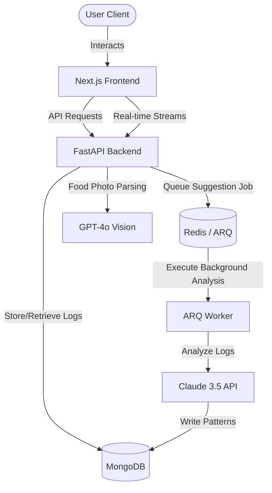

# ✨ AI Health Habit Tracker ✨

An elegant personal health companion that intelligently connects your food logs, sleep patterns, and physical activity to surface actionable, personalized behavioral insights. Powered by **GPT-4o Vision**, this application feels like a premium digital companion rather than a clinical dashboard.

---

## 🚀 Architectural Overview

The application is structured as a decoupled monorepo:
* **Frontend (`/frontend`)**: A high-fidelity, responsive Next.js 14 (App Router) interface built with Framer Motion, Lenis smooth scrolling, Recharts, and custom CSS design tokens.
* **Backend (`/backend`)**: A high-performance async FastAPI service managing data ingestion, AI-powered food vision parsing, an interactive context-aware chat interface, and a background task worker (`arq`) for heavy-lifting pattern analysis.
* **Database & Cache**: MongoDB (with time-series collections for logs) and Redis (caching and task orchestration).



---

## ⚡ Core Features

* **Daily Log**: Log food intake via text or food image (parsed automatically using GPT-4o Vision), sleep metrics, and activity levels.
* **AI Pattern Engine**: Scans 14 days of logs via scheduled background workers to detect deep behavioral correlations (e.g., *"Poor sleep quality 3 nights after high-carb dinners"*).
* **AI Chat Companion**: Ingests your personalized health history to answer questions contextually (e.g., *"Why do I feel tired on Mondays?"*) while enforcing strict non-diagnostic disclaimers.
* **Stunning Dashboard**: Features staggered micro-animations, layout shifts, spring-physics habit rings, and sparkline trends that make habit tracking delightful.

---

## 🛠️ Quick Start with Docker Compose

The easiest way to get the entire database, cache, and API layer running is using Docker Compose:

1. **Configure Environment Variables**:
   Create a `.env` file in the root folder or set your keys in `backend/.env`:
   ```bash
   ANTHROPIC_API_KEY=your-key-here
   OPENAI_API_KEY=your-key-here
   ```

2. **Spin Up the Containers**:
   ```bash
   docker-compose up --build
   ```
   * MongoDB will run on `localhost:27017`
   * Redis will run on `localhost:6379`
   * FastAPI Backend will run on `localhost:8000`

---

## 💻 Manual Setup & Local Development

To run the components individually for debugging and active development, follow these instructions:

### 🐍 Backend Setup (FastAPI)

1. **Navigate to backend and create a virtual environment**:
   ```powershell
   cd backend
   python -m venv .venv
   .venv\Scripts\activate
   ```

2. **Install dependencies**:
   ```powershell
   pip install -r requirements.txt
   ```

3. **Configure Environment Variables**:
   Create a `backend/.env` file with the following variables:
   ```env
   MONGODB_URL=mongodb://localhost:27017
   REDIS_URL=redis://localhost:6379
   ANTHROPIC_API_KEY=your_anthropic_key_here
   OPENAI_API_KEY=your_openai_key_here
   ```

4. **Seed Mock Data (Optional)**:
   Populate your databases with high-quality sample food, activity, and sleep logs:
   ```powershell
   python seed.py
   ```

5. **Start the API Server & Background Workers**:
   * **FastAPI Server**:
     ```powershell
     uvicorn app.main:app --reload --port 8000
     ```
   * **ARQ Background Task Worker**:
     ```powershell
     arq arq_worker.WorkerSettings
     ```

---

### 🎨 Frontend Setup (Next.js 14)

1. **Navigate to the frontend directory**:
   ```powershell
   cd ../frontend
   ```

2. **Install node packages**:
   ```powershell
   npm install
   ```

3. **Start the development server**:
   ```powershell
   npm run dev
   ```
   Open [http://localhost:3000](http://localhost:3000) to view the client app.

---

## 📂 Project Structure

```
├── backend/
│   ├── app/
│   │   ├── api/           # Auth, chat, logs, and pattern routes
│   │   ├── core/          # MongoDB, Redis, and Security config
│   │   ├── models/        # Schemas and DB specifications
│   │   ├── services/      # AI engines (Vision, Pattern, Chat)
│   │   └── main.py        # API Entrypoint
│   ├── arq_worker.py      # Background task queue worker
│   ├── requirements.txt   # Python dependencies
│   └── seed.py            # Sample data seeder
├── frontend/
│   ├── src/
│   │   ├── app/           # Next.js pages & router
│   │   ├── components/    # Reusable spring UI components
│   │   ├── styles/        # CSS variables & design system tokens
│   │   └── hooks/         # Custom state & React Query integrations
│   └── package.json       # Node dependencies & build scripts
├── docker-compose.yml     # Database and Redis container manager
└── health-tracker-prd.md  # Detailed Product Requirement Document (PRD)
```

---

## ✨  Motion Principles

Every interaction in this habit tracker has been carefully tuned to feel premium and tactile:
* **Staggered Entry**: Dashboard components enter with a `50ms` delay gap and standard spring easing.
* **Physical Elasticity**: Habit rings and action buttons use low-mass high-tension spring physics (`scale(0.97)` on click).
* **Interruptible Transitions**: AI chat streams are loaded natively with transitions designed to remain interruptible during rapid message feeds.
* **Layout Shifts**: Pattern addition/deletion events are visual transitions managed via Framer Motion `AnimatePresence`.
